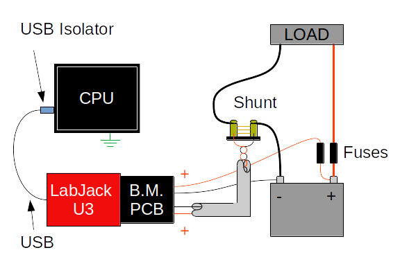
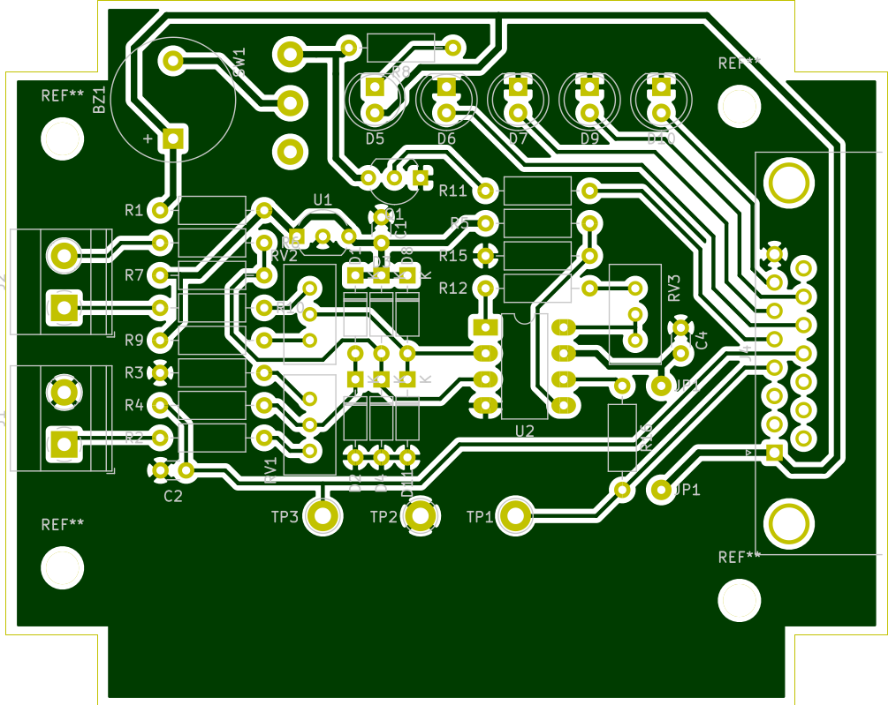

#BatMon

A battery monitor system using the LabJack U3 DAQ
---
## In this README
- About
- License
- Warnings

## About
This repository includes files for a PC board design, Bill-of-Materials (BOM), and code for monitoring a battery from a Linux computer.  These materials are intended for information and inspiration; they do not constitute a complete instruction set.

The designed system uses a U3 DAQ to perform analog measurements and a temperature -measurement.  A shunt resistor provides small (+/-0.1V) signal indicating current to and from the battery, and direct connection to the battery terminals provides a measurement of the battery voltage.

**Figure 1** A system overview

I designed this system on a 12V AGM SLA battery, but it can be applied on battery arrays of other chemistries as well.

## License
BatMon: A battery monitoring system using the LabJack U3.  
Copyright (c) 2021 Christopher R. Martin PhD

These materials are released under the [GNU GPLv3](https://www.gnu.org/licenses/gpl-3.0.en.html).  This program is free software: you can redistribute it and/or modify it under the terms of the GNU General Public License as published by the Free Software Foundation, either version 3 of the License, or (at your option) any later version.

This program is distributed in the hope that it will be useful, but WITHOUT ANY WARRANTY; without even the implied warranty of MERCHANTABILITY or FITNESS FOR A PARTICULAR PURPOSE.  See the GNU General Public License for more details.

You should have received a copy of the GNU General Public License along with this program.  If not, see https://www.gnu.org/licenses/gpl-3.0.en.html .

## Warnings
- Working with power electronics can be dangerous and should only be done by qualified individuals.
- Special care should be taken to avoid accidental short-circuits
- This work is shared without warranty or suitability for a specific purpose.  
- This work should not be used in systems where failure may cause injury, loss of life, or damage to property.
- The performance of the designs shared here depend on workmanship and the sufficient care taken during calibration and installation.
- For safety, all connections to the positive terminal of the battery should be fused to limit the flow of current.

## Circuit

The circuit design is shown in [circuit.pdf](./images/circuit.pdf), and the PC board layout is shown below.  The DB-15 connector on the right-hand side connects to the LabJack U3 DB-15 connection.  There are four screw terminals on the left-hand side that permit the shunt and terminal measurements.  All inputs are reverse polarity and over-voltage tolerant up to 50V.

There are five low-current indicator LEDs (two red and three green).  The first red LED is tied to a special ALARM circuit, which also fires a buzzer.  The buzzer can be switched off manually by a toggle switch mounted at SW1 (every buzzer needs an off switch).

